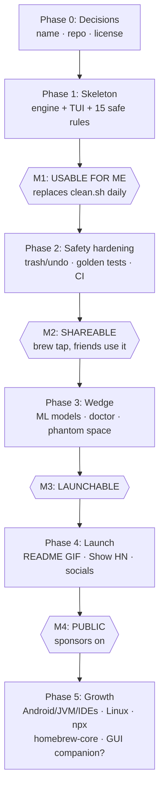

# Zero → Hero Plan

Each phase = one or a few Claude sessions with a ready prompt. Milestones (M1–M4) mark when the thing becomes *usable*, *shareable*, *launchable*, *fundable*.

## Status

<!-- Living tracker. Every session that finishes a prompt ticks its box and moves the "Now" line. Enforced via CLAUDE.md session rules. -->

- [x] P0-A name → **regrow** (2026-07-13)
- [x] P0-B scaffold — repo pushed, CI green (2026-07-13, github.com/lbagic/regrow)
- [x] P1-C engine + schema (2026-07-13)
- [x] P1-D TUI (2026-07-13)
- [ ] P1-E port clean.sh + Tier-S rules → **M1 usable**
- [ ] P2-F safety hardening + brew tap → **M2 shareable**
- [ ] P3-G ML models module
- [ ] P3-H doctor + phantom space → **M3 launchable**
- [ ] P4-I launch kit → **M4 public**

**Now:** Prompt E, fresh session. **Manual TODO:** buy regrow.sh.

---

## Phase 0 — Decisions (1 short session)

**Prompt A — name:**
> Analyze name candidates for the cleaner product (reclaim, regen, hoard, disksmith, sweeper + generate 10 more). Check collisions: brew formula, npm, crates.io, GitHub repos, domains (.dev/.sh), App Store. Criteria: verb-like, typeable, hints "everything deleted regenerates", no snake-oil vibes. Recommend top 3 with evidence.

✅ **Decided (2026-07-13): `regrow`** — tentative, revisit before M2/brew tap. Evidence: crates.io free, brew free, regrow.sh free, npm squatted but dead (8 dl/mo, last publish 2022 — disputable), no GitHub presence (top repo ★23). Runners-up: mow (domains taken), cull (no regen hint). Wildcard if regrow falls through: disksmith (100% clean everywhere, but not verb-like).

**Prompt B — scaffold decisions:**
> Init the repo: git, MIT license, Go module (name from Prompt A), directory layout for: rule engine (rules/*.yaml embedded), scanner, TUI (bubbletea), trash/undo, oplog. Write ARCHITECTURE.md stub. No features yet — structure + CI skeleton (GitHub Actions, macOS runner, lint+test).

Exit: name chosen, repo pushed, CI green on hello-world.

## Phase 1 — Skeleton → **M1: usable for me**

**Prompt C — engine + schema:**
> Implement the rule engine per docs/PRODUCT.md §6: YAML rule schema {id, title, risk, os paths (version-aware), marker discovery, native command, regen story, sudo}, loader, size scanner (du + tool queries), dry-run planner producing exact command list.

**Prompt D — TUI:**
> Bubbletea checklist TUI per PRODUCT.md §4 sketch: grouped by category, size-ranked, risk colors, note on cursor, plan screen before any action. `--json` output mode.

**Prompt E — port clean.sh:**
> Port all modules from clean.sh into YAML rules + add Tier-S from docs/research/02: DerivedData, DeviceSupport, CoreSimulator devices+runtimes (simctl only), docker prune, npm/yarn/pnpm, go, brew, pip/uv, TM snapshots, aerial (Sequoia+Tahoe paths), trash. Golden test per rule with fixture $HOME.

**M1 check:** `regrow` run on this Mac finds ≥60GB, executes via trash, undo works. clean.sh retired.

## Phase 2 — Safety hardening → **M2: shareable**

**Prompt F:**
> Harden: path guards (empty//`/`/$HOME/mounts), trash-not-rm with staging fallback, oplog jsonl + `undo` + `history`, fixture-home golden tests for every rule, race/permission edge cases (read-only go mod cache, root sim runtimes), `--beta-rules` gate. Then: GoReleaser config, brew tap repo, signed release v0.1.

**M2 check:** friend installs via `brew install you/tap/name`, runs it, nothing scary happens. Issues template up.

## Phase 3 — Wedge → **M3: launchable**

**Prompt G — ML module:**
> Implement AI-model support per research/02 §9: HF hub via `hf`/scan-cache (dedup-aware sizes, last-used, delete via CLI), ollama list/rm, LM Studio dir detection, ComfyUI/SD surface-only. Show per-model rows w/ last-used.

**Prompt H — doctor + phantom:**
> `regrow doctor`: hero-bug scanners (~/.claude/debug, mediaanalysisd, .Spotlight-V100, Playwright transform cache) + phantom-space category (TM snapshots, Docker VM real-vs-logical, purgeable) with explainer copy.

**M3 check:** doctor finds something dramatic on ≥1 real machine; screenshot-worthy.

## Phase 4 — Launch → **M4: public**

**Prompt I:**
> Launch kit: README hero (GIF of scan finding X GB, wedge categories first), trust section (dry-run/trash/undo/open rules/test strategy), curl|sh installer, Show HN draft (neutral 8–12 word title) + FAQ answers, r/macos + Lobsters + HelloGitHub posts. Sponsors + Ko-fi enabled.

Launch ritual (manual): Tue–Thu 9–12 ET, reply every comment first hour, follow-up release within days.

## Phase 5 — Growth (post-launch, demand-driven)

Order by issue traffic: Android/JVM rules → JetBrains/VSCode/Cursor → Rust target discovery → Linux → npx (optionalDependencies) → homebrew-core (at ~225 stars) → decide paid GUI companion ($99 Apple dev acct + notarization then).

---

## Session cadence

Each prompt ≈ one focused session. Phases 0–1 ≈ a weekend of evenings. Keep every session ending with: tests green, CHANGELOG line, one dogfood run on the real machine, Status block above ticked.
